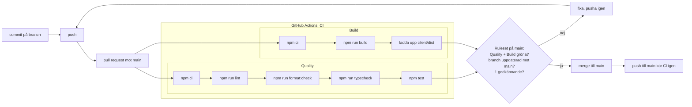

# Pipeline Docs

## Ruleset på main

Rulesetet heter `main` och ligger under _Settings → Rules → Rulesets_.

| Inställning | Värde |
| --- | --- |
| Enforcement status | **Active** |
| Target | Default branch (`main`) |
| Bypass list | Tom – reglerna gäller även admins |

Regler:

- **Restrict deletions** – `main` kan inte raderas.
- **Block force pushes** – ingen kan skriva om historiken på `main`.
- **Require a pull request before merging**
  - Minst **1** godkännande krävs, så ingen kan merga sin egen PR ensam.
  - Tillåtna merge-metoder: merge och squash.
- **Require status checks to pass**
  - Kräver: **`Quality`** och **`Build`** från GitHub Actions. Namnen är
    jobbens `name:` i `.github/workflows/ci.yml`.
  - **Require branches to be up to date before merging** är på – branchen måste
    vara uppdaterad mot `main` innan merge.

## CI flödesdiagram


## Vad varje steg fångar

| Steg | Jobb | Kommando | Fångar |
| --- | --- | --- | --- |
| Installera | Quality, Build | `npm ci` | Att `package-lock.json` inte stämmer med `package.json`, eller att ett beroende inte går att installera. Alla får exakt samma versioner som i lockfilen. |
| Lint | Quality | `npm run lint` (ESLint) | Kodfel som inte syns förrän appen körs: odefinierade variabler, oanvända variabler och importer, trasiga Vue-templates (`eslint-plugin-vue`) och vanliga misstag i testfiler (`@vitest/eslint-plugin`). |
| Format | Quality | `npm run format:check` (Prettier) | Kod som inte följer vår formatering (inga semikolon, enkla citattecken, max 100 tecken per rad). CI kör `--check`, inte `--write`. Den säger bara ja eller nej och ändrar ingen kod. |
| Typkontroll | Quality | `npm run typecheck` (`vue-tsc` i `client/`, `tsc --noEmit` i `api/`) | Typfel mot API-kontraktet i `@utpost/shared`: fel fältnamn (`guide.lengthKm` istället för `length_km`), fält som kan vara `null` men används som om de alltid finns, och routes som svarar med något annat än sin `Response<...>`-typ. |
| Test | Quality | `npm test` (Vitest) | Att testerna går igenom. Just nu finns bara ett röktest som visar att pipelinen faktiskt kör tester. Riktiga tester kommer i M2. |
| Bygge | Build | `npm run build` (Vite) | Kod som inte går att bygga för produktion: importer som pekar på filer som inte finns, syntaxfel och komponenter som inte kompilerar. |
| Artefakt | Build | `upload-artifact` | Fångar inga fel, men sparar det byggda `client/dist` så att man kan ladda ner och titta på exakt det som byggdes. |

Alla steg utom typkontrollen körs just nu bara mot `client/`. Typkontrollen täcker även `api/`. `web/` kontrolleras inte i CI.

## CI Tidsmätning

```bash
== Quality 13s
0s      Set up job
1s      Run actions/checkout@v4
1s      Run actions/setup-node@v4
6s      Run npm ci
1s      Run npm run lint
1s      Run npm run format:check
2s      Run npm test
0s      Post Run actions/setup-node@v4
0s      Post Run actions/checkout@v4
0s      Complete job
== Build 15s
1s      Set up job
0s      Run actions/checkout@v4
1s      Run actions/setup-node@v4
6s      Run npm ci
2s      Run npm run build
1s      Run actions/upload-artifact@v4
0s      Post Run actions/setup-node@v4
0s      Post Run actions/checkout@v4
0s      Complete job
```
